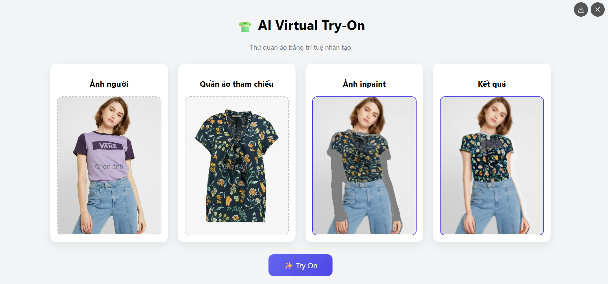

  #  Virtual Try-On (CP-VTON + MV-VTON) on Google Cloud

> Updated Date: 3/7/2026

## TODO

- [x] Preprocess data using OpenPose and human parsing
- [x] Integrate the CP-VTON model for the cloth warping stage
- [x] Integrate the MV-VTON (Frontal View) model for the try-on stage
- [] Deploy the Virtual Try-On system on Google Cloud

## Setup

    pip install -r requirements.txt

Place checkpoints in directory:

    --ckpt
      --GMM
      --openpose
      --MVTON
      --humanparsing

- Openpose:

- Human-parser

- MV-VTON:

- CP-VTON (GMM):

The checkpoints can be obtained from the reference repositories.

## Deploy Local Website

    python app.py

    
    <em>
    Simple user interface for Virtual Try-On.
    </em>

This repository includes a Dockerfile for deployment on Google Cloud.

## Reference

[1] [MV-VTON: Multi-View Virtual Try-On with Diffusion Models](https://github.com/hywang2002/MV-VTON), AAAI 2025.

[2] [IDM-VTON: Improving Diffusion Models for Authentic Virtual Try-on in the Wild](https://github.com/yisol/IDM-VTON), ECCV 2024.

[3] [CP-VTON+: Clothing Shape and Texture Preserving Image-Based Virtual Try-On](https://github.com/minar09/cp-vton-plus), CVPRW 2020.